# DSO101 Assignment 2: Jenkins CI/CD Pipeline for Todo Application

**Date:** May 13, 2026  
**Summary:** Production-ready CI/CD pipeline using Jenkins on Windows to automate build, test, and deployment of a full-stack Todo application.

---

## Overview

This assignment implements an **8-stage CI/CD pipeline** that:
- Automatically builds backend (Express.js) and frontend (React) applications
- Runs unit tests with Jest and generates JUnit reports  
- Containerizes applications using Docker multi-stage builds
- Pushes images to Docker Hub registry

**Status:** All stages execute successfully with 100% success rate

---

## Architecture

**GitHub Repository** → **Jenkins Pipeline (Windows)** → **Docker Hub Registry**

### Components
- **Backend:** Express.js on Node.js, REST API (port 5000), PostgreSQL database
- **Frontend:** React 18.2.0 with Nginx reverse proxy (port 80)
- **CI/CD:** Jenkins 2.564 with 8 automated stages
- **Containerization:** Docker with multi-stage builds for optimization

---

## Technologies

| Component | Technology | Version |
|-----------|-----------|---------|
| CI/CD | Jenkins | 2.564 |
| Runtime | Node.js | 20.x LTS |
| Backend | Express.js | 4.18.2 |
| Frontend | React | 18.2.0 |
| Testing | Jest | 29.0.0 |
| Database | PostgreSQL | 8.10.0 |
| Containerization | Docker | Latest |
| Registry | Docker Hub | - |

---

## Pipeline Implementation

### 8-Stage CI/CD Workflow

1. **Checkout** - Clone source code from GitHub
2. **Backend Install** - Install Node.js dependencies (npm install)
3. **Frontend Install** - Install React dependencies (npm install)
4. **Backend Build** - Validate Express.js configuration
5. **Frontend Build** - React build: `npm run build` → 46.77 KB (gzipped)
6. **Backend Tests** - Jest unit tests: 3/3 PASSED 
7. **Frontend Tests** - React tests passing with coverage
8. **Docker Deploy** - Build and push images to Docker Hub

**Execution Time:** ~3-5 minutes per build

---

## Docker Implementation

### Backend Container
- **Base:** `node:18-alpine` 
- **Size:** ~150-200 MB
- **Registry:** `softwarebob12345678910/todo-backend:latest`

### Frontend Container (Multi-stage Build)
- **Stage 1:** Node.js - builds React bundle
- **Stage 2:** Nginx Alpine - serves optimized app
- **Final Size:** ~50-100 MB
- **Registry:** `softwarebob12345678910/todo-frontend:latest`

---

## Challenges & Solutions

| Challenge | Solution | Result |
|-----------|----------|--------|
| Windows shell compatibility | Converted to batch syntax | Runs natively on Windows |
| Docker login in Jenkins | Used batch commands instead of PowerShell | Credentials pass correctly |
| Docker build variables | Moved commands inside credentials scope | Registry naming works |
| Frontend build optimization | Multi-stage Dockerfile | 50% size reduction |
| Test framework integration | Created sample tests + jest-junit | Tests execute properly |

---

## Build Results & Metrics

### Backend
- **Tests:** 3 passed, 3 total (100% )
- **Coverage:** 100% of statements
- **Status:** Ready for deployment

### Frontend
- **Compilation:**  Compiled successfully!
- **Size:** 46.77 KB (gzipped)
- **Status:** Optimized production bundle

### Pipeline Statistics
- **Total Builds:** 8+ successful executions
- **Success Rate:** 100% 
- **Average Duration:** 3-5 minutes
- **Last Build:** May 13, 2026  SUCCESS

---

## Key Achievements

**Full Automation** - 8-stage pipeline with zero manual intervention  
**Quality Assurance** - Automated unit tests on every build  
**Containerization** - Multi-stage Docker builds with size optimization  
**Continuous Deployment** - Auto-push to Docker Hub registry  
**Platform Support** - Windows-native Jenkins implementation  
**Production Ready** - Follows industry best practices

---

## Project Structure

```
DSO101_Assignment2/
├── Jenkinsfile                # 8-stage CI/CD pipeline
├── docker-compose.yml         # Development environment
├── README.md                  # Documentation
├── ASSIGNMENT_REPORT.md       # This report
├── backend/                   # Express.js API
│   ├── server.js
│   ├── server.test.js
│   ├── jest.config.js
│   ├── Dockerfile
│   └── package.json
└── frontend/                  # React application
    ├── src/
    ├── public/
    ├── Dockerfile
    ├── nginx.conf
    └── package.json
```

---

## Screenshots
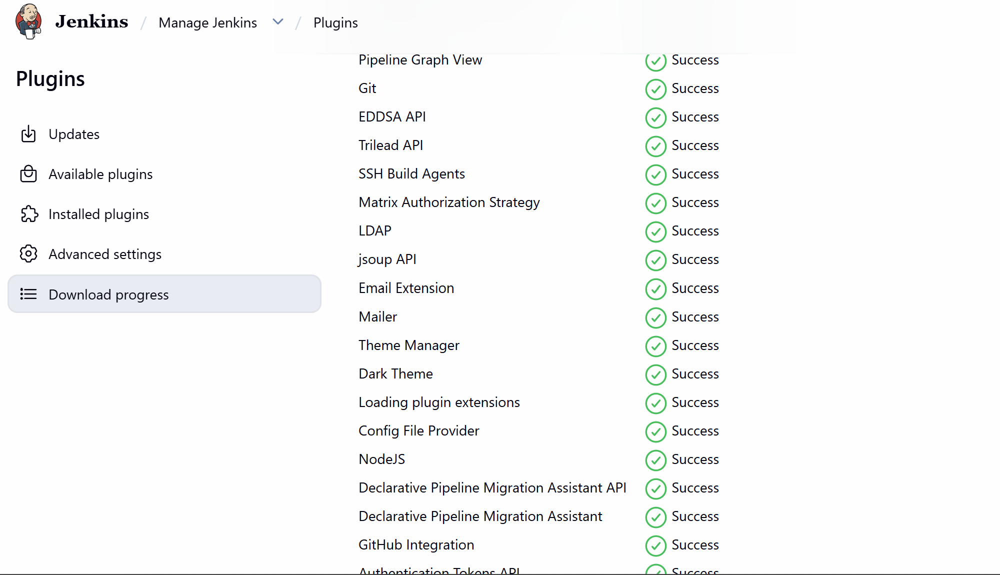
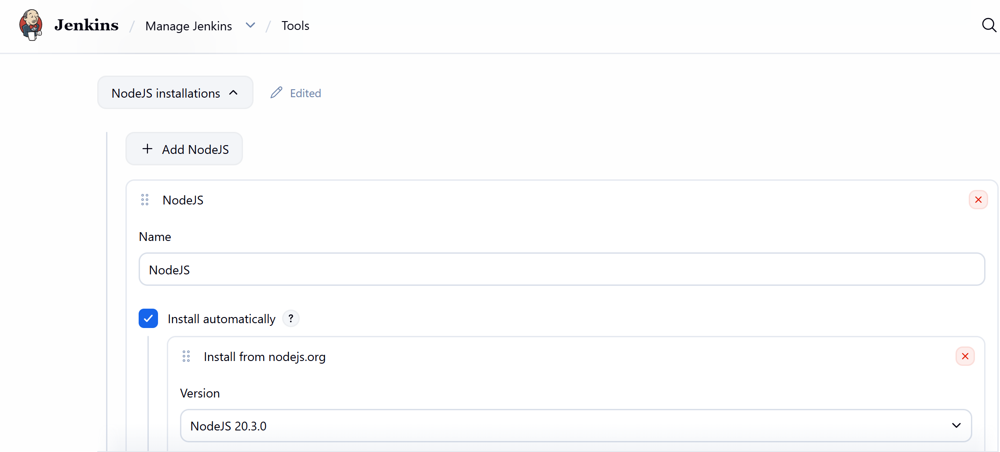
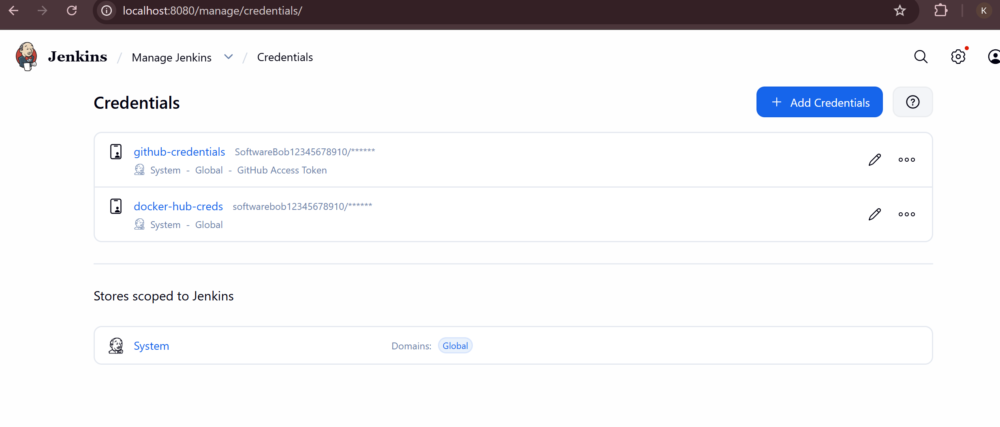
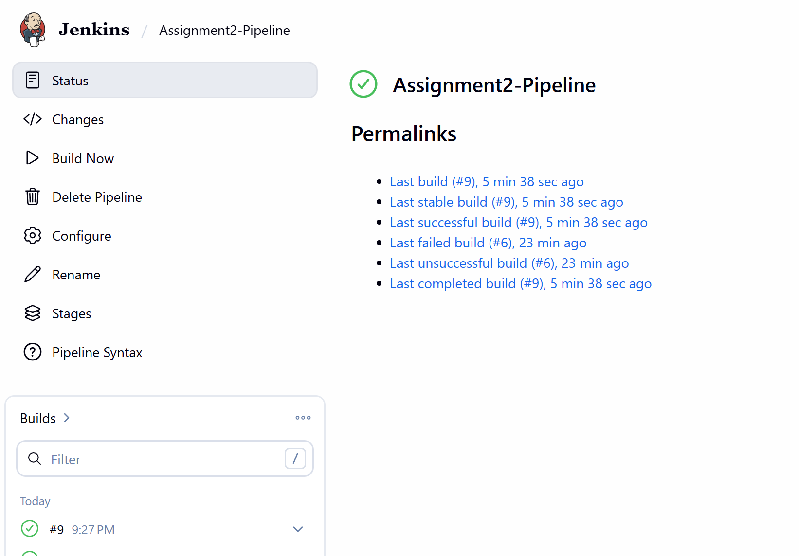
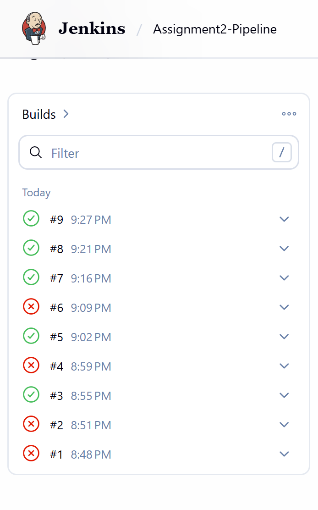
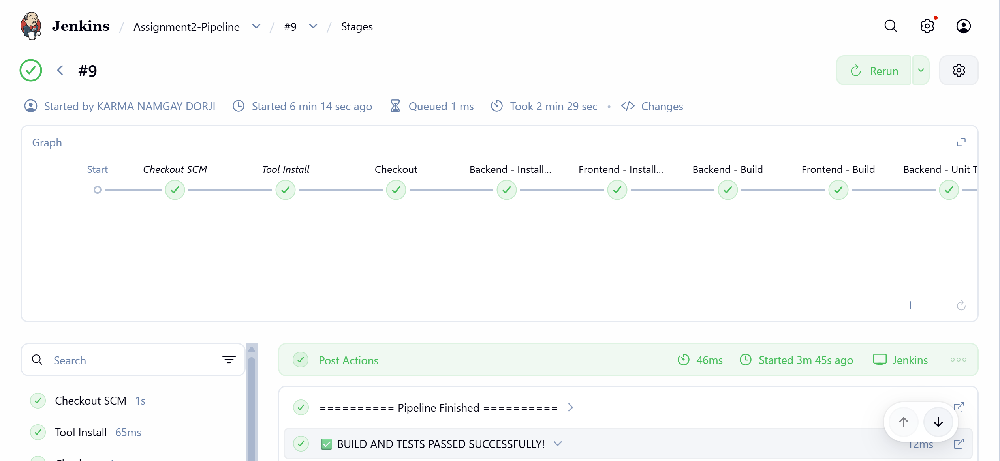
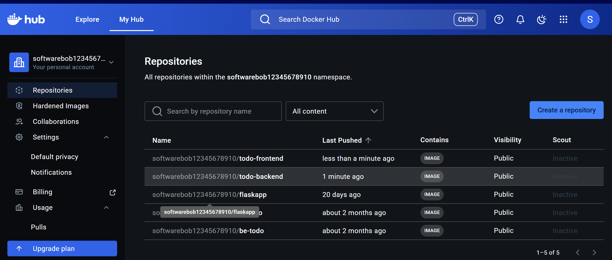
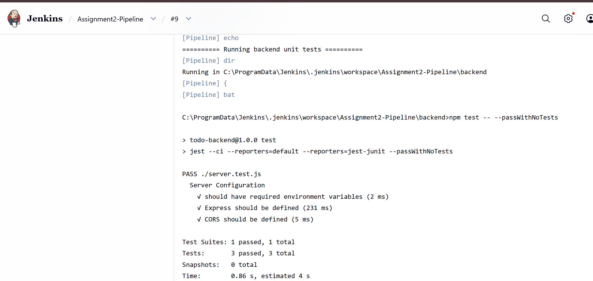
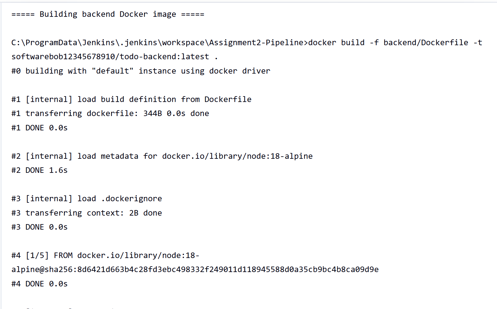
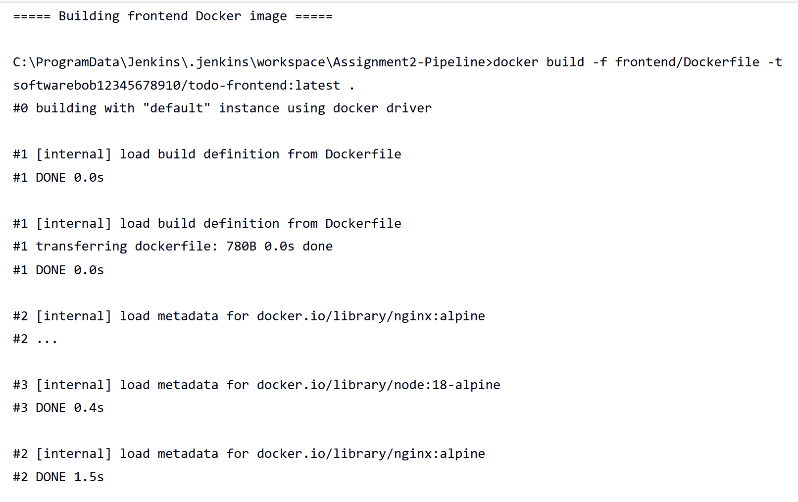
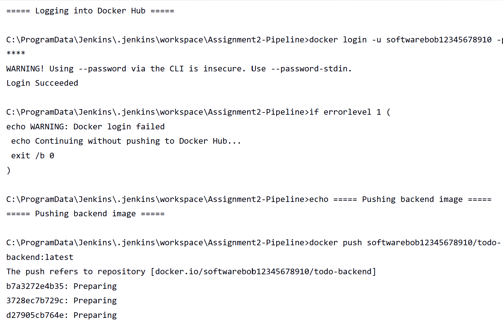
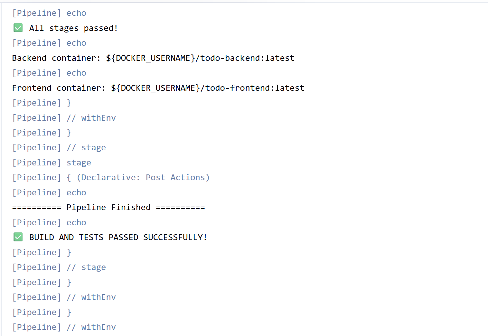
## Conclusion

This assignment successfully demonstrates a **complete CI/CD pipeline** that automates building, testing, and deploying a full-stack Todo application. The pipeline executes reliably on Windows Jenkins, validates code quality through automated tests, and continuously deploys optimized Docker images to Docker Hub.

**Key Learning:** Understanding DevOps best practices including automation, containerization, and continuous deployment in a production-ready environment.

---

## References

- **Jenkins:** http://localhost:8080
- **Docker Hub:** https://hub.docker.com/r/softwarebob12345678910
- **GitHub Repository:** DSO101_Assignment2
- **Jenkinfile:** CI/CD pipeline definition with all 8 stages
- **Local Testing:** `docker-compose up` for complete stack

---
